# CityRank

Rank livable cities based upon user preferences along 3 dimensions.

Release 1.0 MVP User Interface

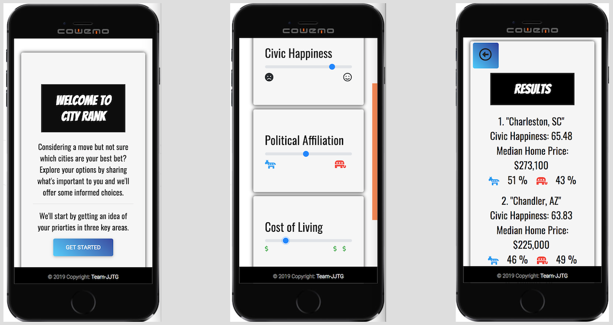

# Value Add Proposal

Simplify your next big move with big data and a clean user interface for specifying preferences for affordability, political affiliation, and overall civic happiness.

Indentify cities that align with your personal beliefs and priorities while putting your stereotypes aside.

# Tech Stack

- Frontend: Bootstrap, jquery, ajax.
- Backend: Firebase
- Pattern: MVC

# Roles

- Jake Stevens - Application concept and fullstack developer.
- Tue Quach - Frontend design
- Jackson Henry - Algorithm design
- Glenn Streiff - Model design, Integration

# MVP

- Phase One - select APIs and implement simple user interface.
- Phase Two - get data flowing, filtered, and uploaded to firebase.
- Phase Three - refine user interface while evolving the controller.
- Phase Four - integrate MVC
- Phase Five - refine, test, present.

# Team Management

[Project Board](https://github.com/team-jjtg/CityRank/projects/1)

# Demo

Our application is hosted [here](https://team-jjtg.github.io/CityRank/).

# Designer's Log

It's April 15, 2019 and we've formed into teams of four. Since we only have 2 weeks to knock out a group project, we're mindful of keeping the scope reasonable.

## Initial Concept

Jackson suggests an application to select a University. Jake suggests we generalize to selecting a city in which to live. We think about various attributes and come up with an interface that features sliders:

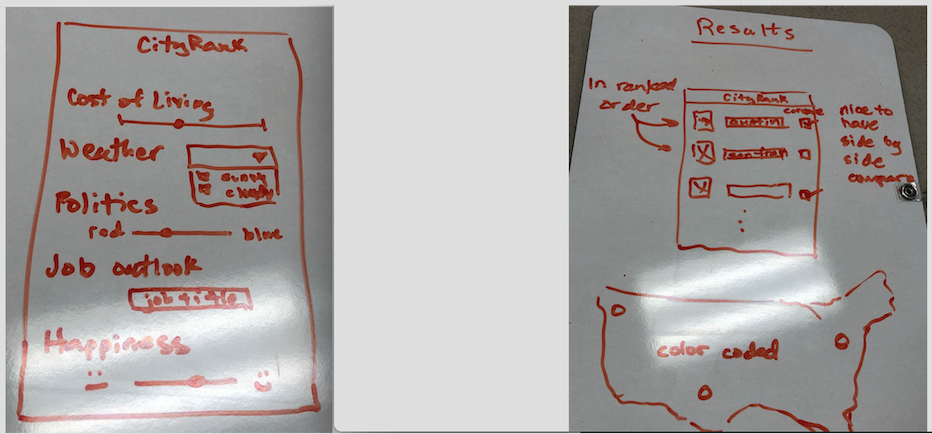

Jake gets us thinking about deliverables:

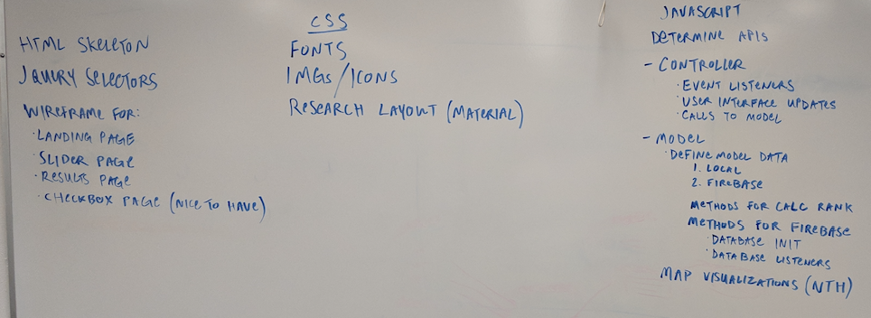

and cleans up our design sketches into wireframes:

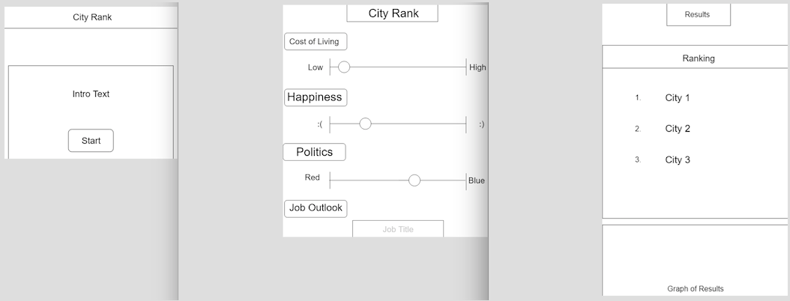

Eventually we scrub on weather since that is actually more nebulous than other metrics.

## Endpoints of Data

The hunt is on for endpoints for the other data.

Jake finds:

- [jooble](https://us.jooble.org/) for jobs
- [api.census.gov](https://api.census.gov/data/2017/acs/acs5/profile?get=DP04_0089E,NAME&for=county:*) for median home price by county, an expedient proxy for affordability
- [civic happiness](https://wallethub.com/edu/happiest-places-to-live/32619)

I find:

- political data at [opendatasoft.com](https://public.opendatasoft.com/api/records/1.0/search/?dataset=usa-2016-presidential-election-by-county&facet=county&rows=3)
- city-to-county mapper at [statsamerica.org](http://statsamerica.org/CityCountyFinder/Default.aspx)

## Our Data Model

This data gets cooked down into several objects:

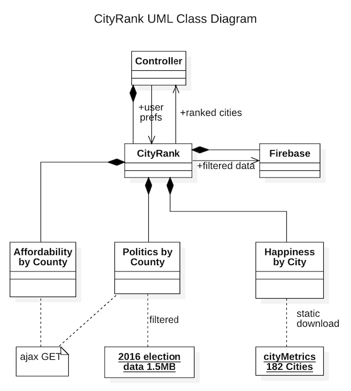

The political data set is huge, over 100 MB encompassing all 3143 counties:

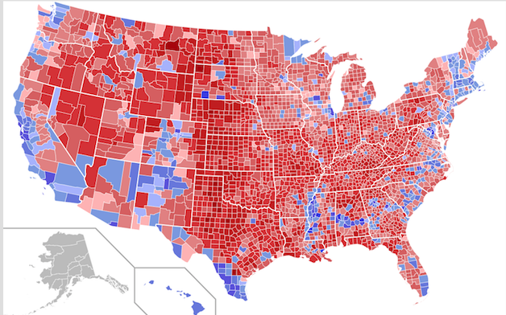

I elect to post-process that down to 1.5 MB and check-it in.

The civic-happiness data is similarly rendered down to 182 lines of array data. Out of practicality, we'll limit our search to this list. The trick now becomes back-filling the other parameters of interest to match these cities (i.e., political affiliation, affordability, and job outlook). To do this, we'll need a county-to-city lookup since
our political data and affordability data are organized by county.

Soon data starts to flow with ajax calls to gather median home price (and county data):

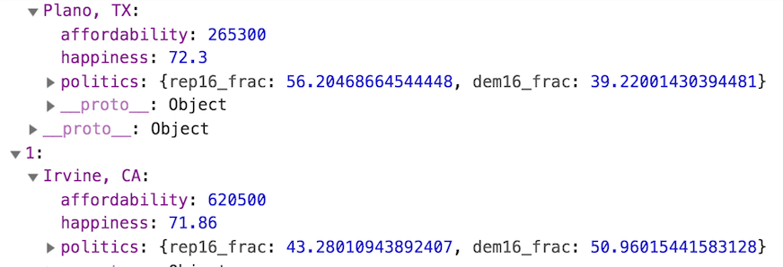

Our goal is to crunch down all this bulky data and upload to firebase where it can be used as our own custom-endpoint for the app:

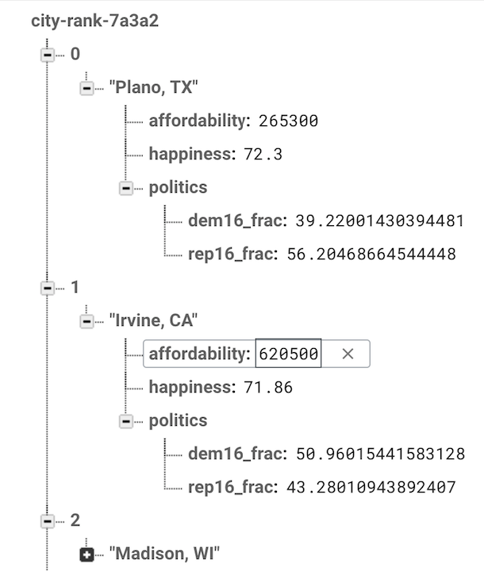

## Bugs and Rabbit Holes

Along the way, we encounter bugs like this where one dataset uses a slightly different name for a county (i.e, 'Lucie County' versus 'St. Lucie County'). We either augment out methods to normalize this or expediently nix that city in the heat of battle toward MVP.

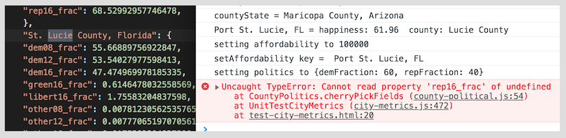

The other interesting bug is that firebase does not like your keys to have '.' dots in them:

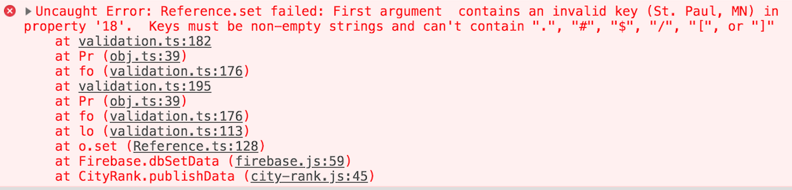

Initially I think it would be cool to explore Material Lite UI, and that sends Tue on a steep learning curve that our kind TAs suggest we abandon for something simpler like Materialize or, as Tue finds, Bootstrap's Material Design.

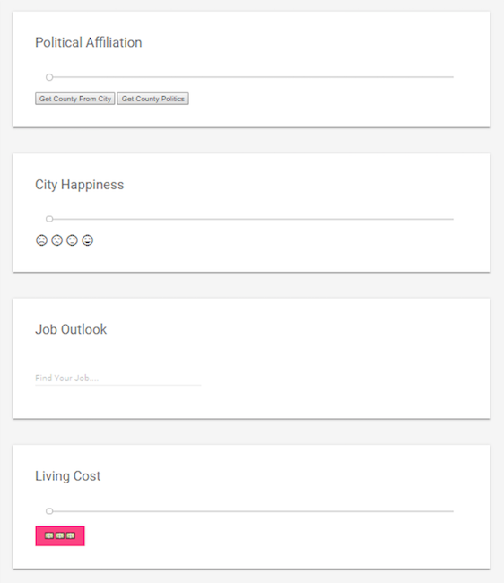

## Ranking Algorithm

Jackson works on the algorithm for ranking our cities.

You can think about a user's preferenes as existing at a point in three-dimensional space, with each preference lying on a separate axis (for affordability, politics, and civic happiness):

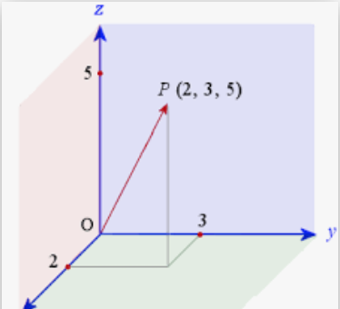

The same goes for each city. Each city is also associated with those same 3 attributes and can be represented by a point or vector in space. So out 182 cities of interest are scattered about in 3-space:

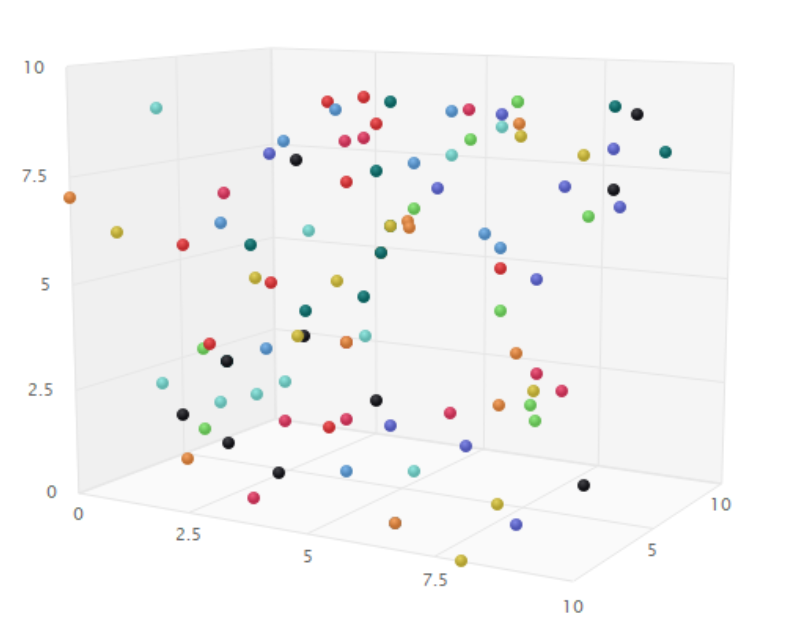

Then the trick is to compute the distance between the user's preference vector and a city's attribute vector by means of this distance equation between two points in space:

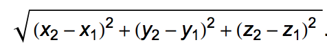

You do that for each city and the user preferences and dump that into an array to be sorted. The shortest distance between the preference point and a city gives you the 'best' match to those preferences. All our cities are ranked this way.

Finally, we also scale each axis to a range of 0 to 100 to give each preference equal weight in the distance formulat.

## Integration

After Jake hands me some example code for interfacing with the jobs and affordability endpoints, I focus on the model and Jake shifts to working with Tue on the frontend.

The integration between the frontend and backend goes pretty quickly, about two hours of effort. Then it is all about smoothing out the rough edges and deciding we don't have runway to complete the job-lookup, though we leave it grayed-out in the design to suggest a future direction.

At this stage, we have something upon which we could build:

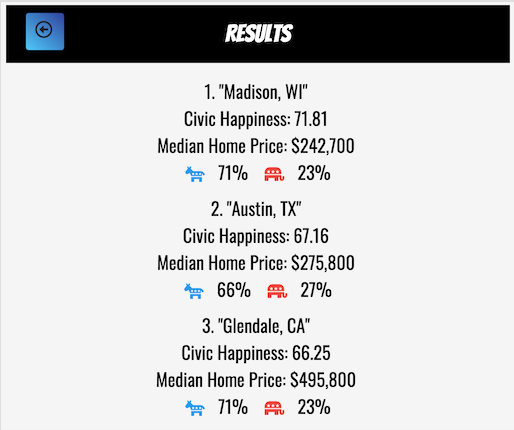

## Future Direction

Perhaps as a second project, we could add more interesting visualizations:

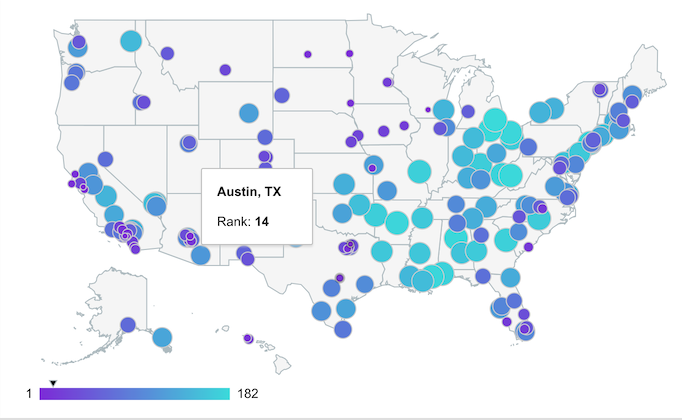
